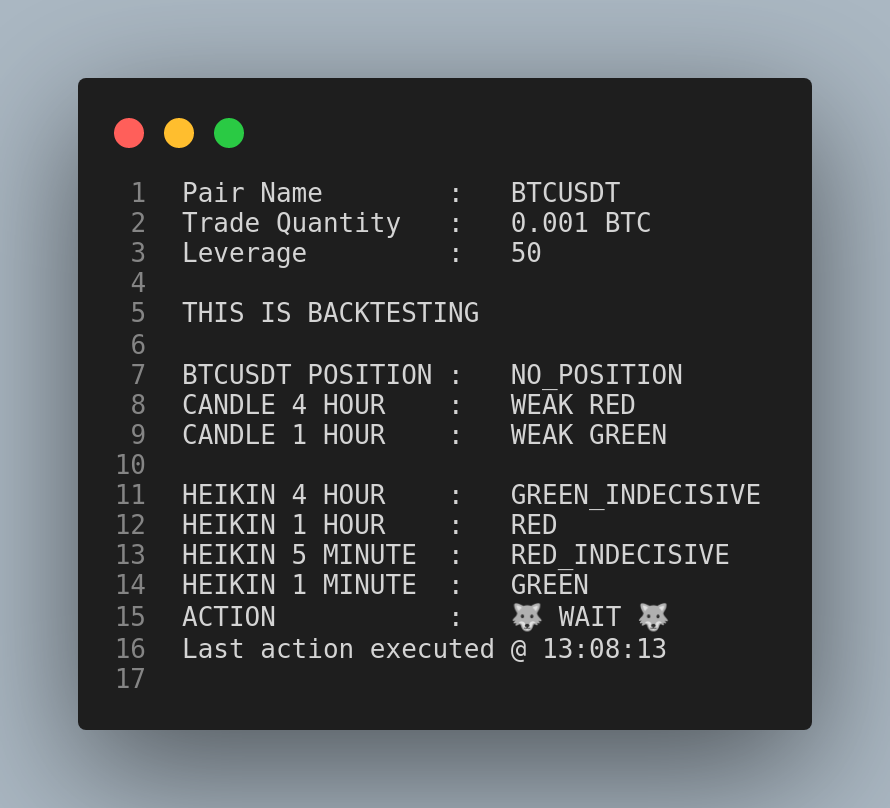

# This project is deprecated.
This trading bot strategy works well during year 2020-2021, however it is not longer suitable for 2022 market trend.  
Hence, this project will no longer maintained and updated.  

If you are interested in other trading bot, kindly visit [Buy Low Sell High](https://github.com/zyairelai/buy-low-sell-high) (Works well) and [Binance Copycat](https://github.com/zyairelai/binance-copycat) (Work in Progress)

## TABLE OF CONTENTS

1. [FUTURES-HERO](#futures_hero)
2. [DISCLAIMER](#hello_disclaimer)
3. [HOW-IT-WORKS](#how_it_works)
4. [HOW-TO-USE](#how_to_use)
    1. [ENVIRONMENT SETUP](#environment_setup)
    2. [PIP3 REQUIREMENTS](#pip3_requirements)
    3. [CONFIGURATIONS](#configurations)
    4. [RUN](#run)
5. [SCREENSHOTS](#hello_screenshots)
    - [SAMPLE-OUTPUT](#sample_output)
6. [JOIN-MY-DISCORD](#discord)
    - [QUICK ACCESS TO THE DARK DIMENSION](https://discord.gg/6J2mXvYsFB)
    - Please email or create an issue if the invitation link does not work  

<a name="futures_hero"></a>
## FUTURES-HERO
Leverage Trading Automation on Binance Futures.  
This is a `Set and Forget` script, means you need to keep it running 24/7 and forget about it.  
**The bot is stable in current version therefore no new changes until new bugs been spotted.**  
**I do not use this bot personally, however, I do use the other 2 bots:**  
- https://github.com/zyairelai/buy-low-sell-high
- https://github.com/zyairelai/long-term-low-leverage

<a name="hello_disclaimer"></a>
## DISCLAIMER
This automation software is implemented base on my PERSONAL MANUAL TRADING STRATEGY.  
However not all my manual trading strategies are completely transformed into code.  
For example, common sense, 6th sense, knowing when to stop trading are **NOT** the part I could do in this code.  

**LEVERAGE TRADING IS A HIGH RISK GAME.**  
**PLEASE MANAGE YOUR RISK LEVEL BEFORE USING MY SCRIPT.**

<a name="how_it_works"></a>
## HOW-IT-WORKS
In short, this code takes these few conditions into considerations:  
4-hour timeframe, 1-hour timeframe and 1-minute timeframe

1. It checks the overall main direction, 4-hour.  
   Let's say the newest current 4-hour candle is `GREEN`.  

2. Then it checks the 1-hour candle for confirmation.  
   Let's say the newest current 1-hour candle is matched with 4-hour candle `GREEN`.  

3. Since both main direction and confirmation are `GREEN`, now it will find an entry  
   (The part which I am not able to implement into code). 

4. The entry will be on the 1-minute chart.  
   In the case above, it will look for a `LONG` position entry.

<a name="how_to_use"></a>
## HOW-TO-USE
<a name="environment_setup"></a>
### 1. ENVIRONMENT SETUP
Paste the following into your Default Shell
```
export BINANCE_KEY="your_binance_api_key"
export BINANCE_SECRET="your_binance_secret_key"
```

Or as an ALTERNATIVE, you can change `line 7-9` in `binance_futures_api.py` to following: 
```
api_key     = "your_binance_api_key"
api_secret  = "your_binance_secret_key"
client      = Client(api_key, api_secret)
```
Don't forget the `" "` symbol to make your API key into `STRING` type!  

**I WILL NO LONGER ANSWER QUESTION REGARDING TO THIS ERROR:**
```
AttributeError: 'NoneType' object has no attribute 'encode'
``` 
**QUICK GOOGLE SEARCH or FIX YOUR API KEY**  
**DO NOT SPAM MY EMAIL AND DISTURB MY PEACEFUL LIFE LOL**

<a name="pip3_requirements"></a>
### 2. PIP3 REQUIREMENTS
To install all the dependencies requirements in one line:
```
pip3 install -r requirements.txt
```
Or if you prefer to install these libraries one by one:
```
pip3 install ccxt
pip3 install numpy
pip3 install pandas
pip3 install requests
pip3 install termcolor
pip3 install python-binance
pip3 install cryptography==3.4.6
```

<a name="configurations"></a>
### 3. CONFIGURATIONS
Before running, maybe you want to see how the output looks like.  
The settings can be configured in `config.py`.

| Variables           | Description                                                                                            |
| --------------------| -------------------------------------------------------------------------------------------------------|
| `live_trade`        |`True` to place actual order <br /> `False` to see sample output                                        |
| `coin`              | You can put your coin list here, to add more it will be ["BTC", "ETH"]                                 |
| `quantity`          | Trade amount. You can run `util_cal_tradeAmt.py` to check the trade amount                             |

The following code illustrate how you add more pairs to trade with:  
```
coin = ["BTC", "ETH"]
quantity = [0.001, 0.01]
```
**IMPORTANT NOTE:**  
- Check your minimum trade size here https://www.binance.com/en/futures/trading-rules/perpetual

<a name="run"></a>
### 4. RUN
You can select your strategy in the `strategies` folder.  

Just replace the `strategy.py` file with any strategy in that folder and you are good to go.  

The default strategy is `strategy_hybrid.py`.  

Now if you are all ready, set `live_trade = True` and ...

Let's make the magic happens!
```
python3 run.py
```

**Make sure you are having Python 3.8 as default python, else you might need to specify your path with python3.8**

<a name="hello_screenshots"></a>
## SCREENSHOTS

<a name="sample_output"></a>
### SAMPLE OUTPUT
<p align="center">
  
</p>

<a name="discord"></a>
## [JOIN MY DISCORD - QUICK ACCESS TO THE DARK DIMENSION](https://discord.gg/6J2mXvYsFB)
### Please email or create an issue if the invitation link does not work  
